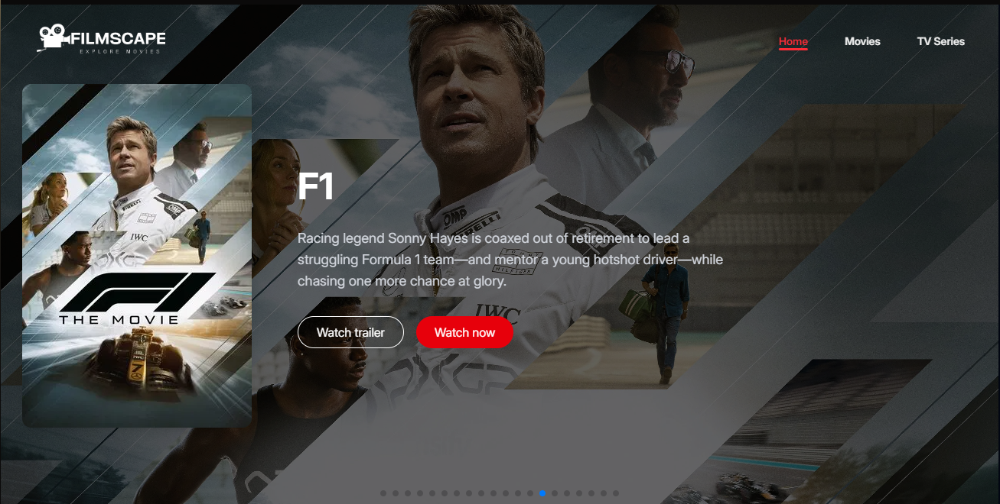
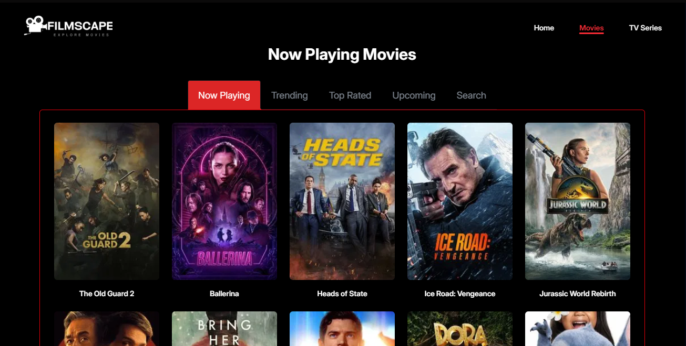
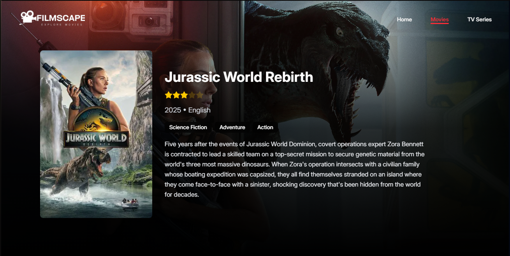

# 🎬 FilmScape - Modern Movie & TV Explorer

<p align="center">
  
  
  
</p>

**FilmScape** is a modern, full-stack web application built with React, TypeScript, and TMDB API. Designed as a personal portfolio project, it provides users with an immersive platform to explore movies and TV shows with detailed information, filters, and dynamic content presentation.

## 🌟 Features

- 🔎 Explore movies and series by category:  
  - **Movies**: Now Playing, Top Rated, Trending, Upcoming  
  - **TV Shows**: Airing Today, On The Air, Top Rated, Trending  
- 🧠 Smart search and filter functionality  
- 🎞️ Movie & TV details with:
  - Overview & rating  
  - Cast list  
  - YouTube trailers  
  - Seasons (for series)  
  - Similar and recommended content  
  - Reviews from other users  
- 📱 Responsive design with smooth animations  
- ⚙️ Future roadmap includes:
  - User authentication  
  - Posting user reviews and ratings  
  - Saving favorites & watch history  
  - User profiles

---

## 🚀 Tech Stack

- ⚛️ React + TypeScript  
- 🎨 Tailwind CSS + DaisyUI  
- 🧩 Headless UI  
- 📡 TMDB API  
- ⚡ Vite  
- 🔄 React Router

---

## 🛠 Getting Started

### Installation

Install project dependencies:

```
npm install
```

### Development

Run the development server with HMR:

```
npm run dev
```

Your app will be available at `http://localhost:5173`.

---

## 📦 Building for Production

Generate the production build:

```
npm run build
```

Output will be created in the `/build` directory:
```
├── client/ # Static assets
└── server/ # Server-side code
```

---

## 🚀 Deployment

### Vercel / Netlify

This app is ready for deployment on [Vercel](https://vercel.com/) or [Netlify](https://www.netlify.com/). Simply connect your GitHub repo and enable auto-deploys from `main` or your chosen branch.

### Docker Deployment

To deploy using Docker:

```
docker build -t filmscape .
```

``` 
docker run -p 3000:3000 filmscape
```

Compatible with platforms like:

- AWS ECS  
- Google Cloud Run  
- Fly.io  
- Railway  
- DigitalOcean App Platform

---

## 🎨 Styling

Tailwind CSS is fully integrated with custom DaisyUI components and dark-mode support. Feel free to customize or extend the styles to match your needs.

---

## 💡 Motivation

This project was created to demonstrate modern front-end architecture and interaction with real-world APIs. It serves as a showcase for full-stack development skills, including animation, API integration, and UI/UX best practices.

---

> Built with ❤️ by an indie dev who loves both cinema and code.
